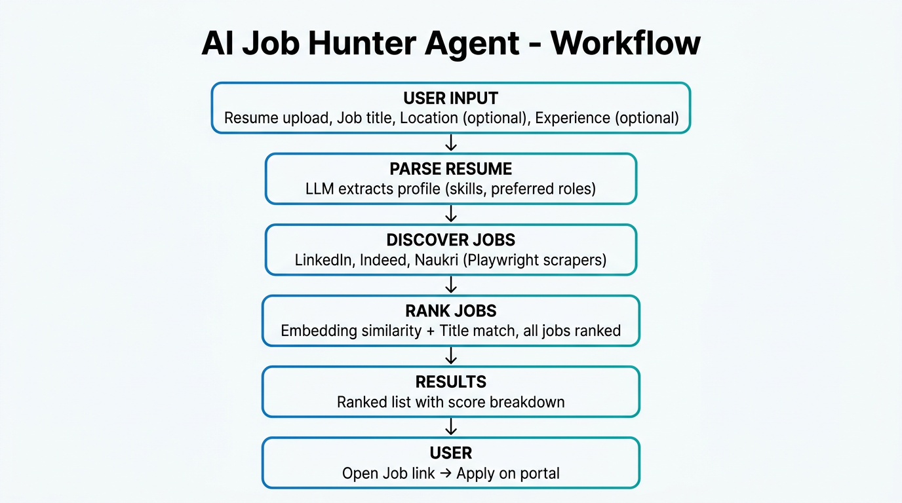

# AI Job Hunter Agent

**Job search made smart.** A production-style system that automatically **discovers**, **ranks**, and surfaces relevant jobs from LinkedIn, Indeed, and Naukri using semantic similarity with your resume. Job hunter • job search • job finder • LinkedIn jobs • Indeed jobs • Naukri jobs.

## Workflow



## Features

- **Resume parsing** — Extract structured data from PDF/TXT resumes via LLM
- **Multi-portal job discovery** — Live scraping from LinkedIn, Indeed, Naukri
- **Semantic ranking** — Rank jobs by similarity to your resume using embeddings
- **🔥 Custom Job Search Agent** — Autonomous agent that searches & notifies on WhatsApp
  - Upload resume once, get automatic job matches
  - WhatsApp notifications for high-match jobs
  - Schedule periodic searches (hourly, daily, weekly)
  - Smart deduplication (no repeat notifications)
- **Application tracking** — Track application status in SQLite
- **LangGraph workflow** — Orchestrated pipeline: parse → discover → rank
- **FastAPI backend** — REST API for integrations
- **Streamlit dashboard** — Web UI for resume upload and workflow execution

## Project Structure

```
ai_job_hunter_agent/
├── agents/           # LLM agents (resume, discovery, ranking, application, tracking)
├── rag/              # Embeddings, Chroma vector store, retriever
├── workflows/        # LangGraph job hunter graph
├── tools/            # Browser automation, LinkedIn/Indeed/Naukri scrapers
├── database/         # SQLite models and session management
├── api/              # FastAPI backend
├── dashboard/        # Streamlit UI
├── config/           # Settings and env config
├── main.py           # Entry point (api, dashboard, workflow CLI)
└── requirements.txt
```

## Setup

```bash
cd ai_job_hunter_agent
python -m venv venv
source venv/bin/activate  # or `venv\Scripts\activate` on Windows
pip install -r requirements.txt
playwright install chromium
```

Create a `.env` file:

```
OPENAI_API_KEY=your_key_here

# Optional: WhatsApp notifications (Twilio)
TWILIO_ACCOUNT_SID=your_account_sid
TWILIO_AUTH_TOKEN=your_auth_token
TWILIO_WHATSAPP_NUMBER=+14155238886
```

**For WhatsApp notifications:**
1. Sign up at [twilio.com](https://www.twilio.com)
2. Get credentials from Twilio Console
3. Activate WhatsApp sandbox: [console.twilio.com/us1/develop/sms/try-it-out/whatsapp-learn](https://console.twilio.com/us1/develop/sms/try-it-out/whatsapp-learn)
4. Send "join <your-sandbox-name>" to Twilio's WhatsApp number

## Usage

**Run FastAPI server:**
```bash
python main.py api
```

**Run Streamlit dashboard:**
```bash
python main.py dashboard
```

**Run workflow from CLI:**
```bash
python main.py workflow --resume data/uploads/resume.pdf --role "AI Engineer" --location "India"
```

**Custom Job Search with WhatsApp:**
```bash
# One-time search with notifications
python agents/custom_search_agent.py 1 +919876543210 "Bangalore"

# Schedule daily searches at 9 AM
python notifications/scheduler.py add 1 +919876543210 --frequency daily --hour 9

# Start scheduler daemon (keeps running in background)
python notifications/scheduler.py start
```

**Optional:** Set `USE_DEMO_JOBS_ON_EMPTY=true` in `.env` to show 3 demo jobs when scrapers return 0 (for testing). Default is false (live-only; no demo).

## API Endpoints

### Core Workflow
- `GET /api/health` — Health check
- `POST /api/upload-resume` — Upload resume file
- `POST /api/run-workflow` — Run full workflow
- `GET /api/applications` — List applications
- `GET /api/jobs` — List discovered jobs
- `GET /api/resumes` — List uploaded resumes

### Custom Search with WhatsApp
- `POST /api/custom-search` — Run one-time custom search with WhatsApp notifications
- `POST /api/schedule-search` — Schedule periodic searches
- `DELETE /api/schedule-search/{resume_id}` — Remove scheduled search
- `GET /api/scheduled-searches` — List all scheduled searches

**Example:**
```bash
# Run custom search
curl -X POST http://localhost:8000/api/custom-search \
  -H "Content-Type: application/json" \
  -d '{
    "resume_id": 1,
    "user_phone": "+919876543210",
    "location": "Bangalore",
    "min_score": 0.7,
    "max_jobs_per_search": 5
  }'
```

---

*Keywords: job hunter, job search, job finder, job discovery, LinkedIn jobs, Indeed jobs, Naukri jobs, AI job search, resume ranking, job scraper, job aggregator, LangGraph, Streamlit.*
